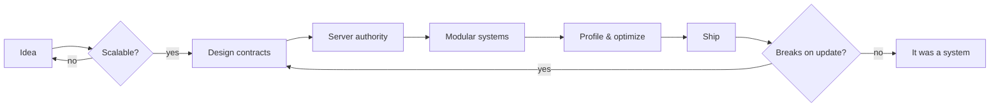

<p align="center">
  
</p>

<p align="center">
  
</p>

<p align="center">
  <a href="https://discord.com/users/897197671591317564">
    
  </a>
  
  
  
</p>


## 🧬 Tech Arsenal

<p align="center">
  
</p>
<p align="center">
  
</p>

<p align="center">
  
  
  
  
</p>


## 🖥️ Terminal

```bash
> whoami
Woster — systems developer

> contact
discord: woster.

> stack --list
lang    : Luau  ·  C#  ·  TypeScript  ·  C++  ·  JS
web     : HTML  ·  CSS  ·  React
tooling : Git · VS Code · Visual Studio · Rojo

> skills --focus
- Server-authoritative architecture
- Modular, scalable system design
- Data & persistence layers
- UI/UX logic & interaction flow
- Performance profiling / netcode

> uptime
still refactoring.
```


## 🎮 Live Presence

<p align="center">
  
</p>


## 🧠 About

I build systems designed to **scale, perform, and survive**.

Not interested in messy scripts.
Not interested in quick hacks.

Only clean logic, real structure, and gameplay impact.

> If your system breaks after one update, it was never a system.

```csharp
public sealed class Woster : IDeveloper
{
    public string   Mindset   => "Server-authoritative, always.";
    public string[] Languages => ["Luau", "C#", "TypeScript", "C++", "JS"];
    public bool     ShipsHacks => false;

    public Result<Feature> Build(Idea idea)
        => idea.IsScalable
            ? Feature.From(idea).WithTests().WithDocs()
            : Result.Fail("Refactor the design first.");
}
```

```ts
const philosophy = {
  clientTrust: 0,               // never
  singleResponsibility: true,
  magicNumbers: [] as never[],
  onUpdateBreaksEverything: () => "then it wasn't architecture",
} as const;
```


## ⚙️ Power Levels

```txt
Systems Design           ██████████░░  85%
Roblox / Luau            ██████████░░  85%
TypeScript               ████████░░░░  72%
UI / UX Logic            ████████░░░░  70%
Data Systems             ████████░░░░  70%
HTML / CSS / JS          ███████░░░░░  65%
C# / .NET Backend        █████░░░░░░░  50%
C++                      ████░░░░░░░░  40%
AI / Automation          ████░░░░░░░░  35%
```


## 🏗️ How I Build




## 🧩 Dev Reality

```txt
✔ "Just one small change"
→ breaks entire system

✔ "This should work"
→ doesn't work

✔ "Fixed it"
→ created 2 new bugs

✔ "It works on my machine"
→ ship the machine
```


## 📊 Language Breakdown

<p align="center">
  
  
</p>

<p align="center">
  
</p>


<p align="center">
  <i>"Systems don't fail loudly. They fail where nobody looked."</i>
</p>

<p align="center">
  
</p>
